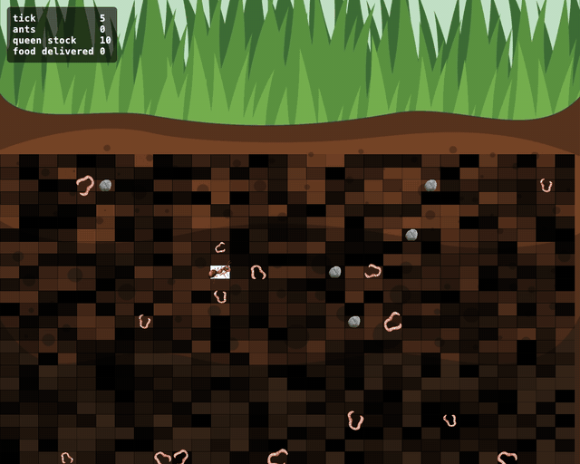

# Ant colony simulation



An underground ant colony in Java on [JBotSim](https://jbotsim.io): ants dig their own tunnels, find food with pheromone trails and bring it back to the queen. Green = food pheromone, blue = queen pheromone. [Full-size video](media/colony.mp4).

School project (ENSEIRB-MATMECA, mobile algorithms) by Laurent Genty and Johan Chataigner — [subject](https://www.labri.fr/perso/acasteig/teaching/algomob/practice/?p=ants-fr), [report (FR)](rapport_algomob_genty_chataigner.pdf). Modernized in 2026.

## Run it

Requires Java 21. No IDE needed.

```bash
./gradlew run                      # interactive window, random seed (printed at start)
./gradlew run --args="--seed 42"   # replay a given seed
```

Press `P` in the window to hide/show pheromones.

## Regenerate the media

Requires `ffmpeg` (`brew install ffmpeg`).

```bash
./gradlew capture                  # seed 3, 3000 ticks → media/colony.{gif,mp4}, media/colony-poster.png
./gradlew capture -PcaptureSeed=7  # try another seed
```

Frames are rendered headlessly with a manual clock, so the same seed always gives the same video.

## Tests

```bash
./gradlew test
```

## Simulation rules

- **World**: side view, 30×25 grid of soil cells with random hardness. Food appears deep down, rocks (impassable) a bit higher.
- **Queen**: sits in a dug chamber, lays an ant now and then (costs 1 food); dies when her stock is empty.
- **Ant**: moves cell by cell (8 neighbours); an undug cell must be dug first, which takes longer for harder soil.
- **Searching**: lays queen pheromone at each step, goes to food it senses, otherwise follows the strongest food pheromone, otherwise wanders.
- **Returning**: takes 1–2 food, lays food pheromone at each step and follows the strongest queen pheromone home.
- **Evaporation**: pheromones fade exponentially; food trails vanish in ~1000 ticks, queen trails in ~2000.

## Improvements since the 2020 school version

1. Ants now follow the **strongest** trail (neighbours were sorted weakest first).
2. Pheromones now **evaporate** (the cell clock was never registered).
3. Evaporation is **progressive** instead of a full reset every 1000 ticks.
4. Rocks keep **spawning** during the run (the rock spawner was never registered).
5. Pheromones can reach the **maximum** of 1 (deposits above 0.9 were dropped).
6. Ants re-plan only on **arrival** instead of every tick.
7. A starving queen **no longer lays** an ant after dying.

Also: Gradle build (no IntelliJ needed), one seeded random source, live pheromone overlay, colony HUD, ants never freeze when boxed in by rocks, headless capture.
